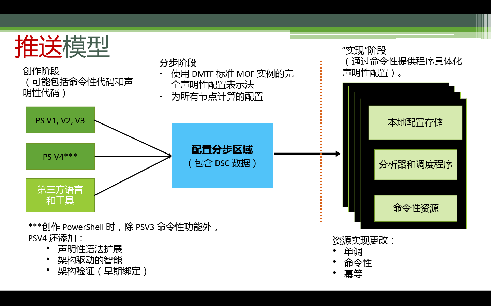
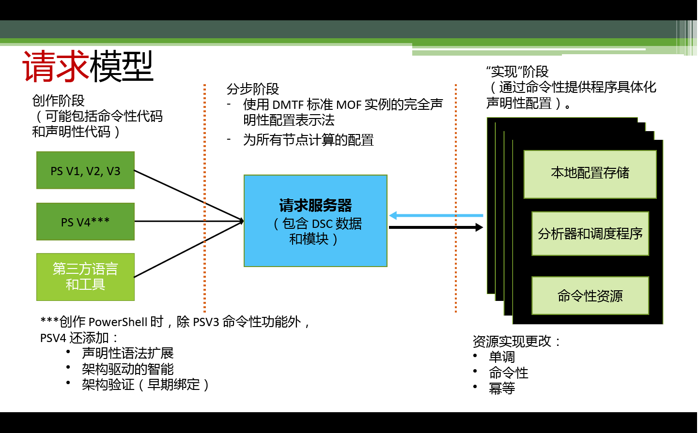

# 执行配置Enacting configurations

>适用于：Windows PowerShell 4.0 和 Windows PowerShell 5.0Applies To: Windows PowerShell 4.0, Windows PowerShell 5.0

有两种执行 PowerShell Desired State Configuration (DSC) 配置的方法：推送模式和请求模式。There are two ways to enact PowerShell Desired State Configuration (DSC) configurations: push mode and pull mode.

## 推送模式Push mode

推送模式指的是用户通过调用 [Start-DscConfiguration](https://technet.microsoft.com/en-us/library/dn521623.aspx) cmdlet 主动将配置应用到目标节点。Push mode refers to a user actively applying a configuration to a target node by calling the [Start-DscConfiguration](https://technet.microsoft.com/en-us/library/dn521623.aspx) cmdlet.

创建并编译配置后，可通过调用 [Start-DscConfiguration](https://technet.microsoft.com/en-us/library/dn521623.aspx) cmdlet，并将 cmdlet 的 -Path 参数设置为配置 MOF 所在的路径，从而在推送模式下执行该配置。After creating and compiling a configuration, you can enact it in push mode by calling the [Start-DscConfiguration](https://technet.microsoft.com/en-us/library/dn521623.aspx) cmdlet, setting the -Path parameter of the cmdlet to the path where the configuration MOF is located. 例如，如果配置 MOF 位于 `C:\DSC\Configurations\localhost.mof` 中，则使用以下命令将其应用于本地计算机：`Start-DscConfiguration -Path 'C:\DSC\Configurations'`For example, if the configuration MOF is located at `C:\DSC\Configurations\localhost.mof`, you would apply it to the local machine with the following command: `Start-DscConfiguration -Path 'C:\DSC\Configurations'`

> __注意__：默认情况下，DSC 运行配置作为后台作业。__Note__: By default, DSC runs a configuration as a background job. 若要以交互方式运行此配置，请使用 __-Wait__ 参数调用 [Start-DscConfiguration](https://technet.microsoft.com/library/dn521623.aspx)。To run the configuration interactively, call the [Start-DscConfiguration](https://technet.microsoft.com/library/dn521623.aspx) with the __-Wait__ parameter.

## 请求模式Pull mode

在请求模式下，配置请求客户端以从远程请求服务器中获取所需的状态配置。In pull mode, pull clients are configured to get their desired state configurations from a remote pull server. 同样，已将请求服务器设置为托管 DSC 服务，并提供了请求服务器所需的配置和资源。Likewise, the pull server has been set up to host the DSC service, and has been provisioned with the configurations and resources that are required by the pull clients. 每个请求客户端都有计划的任务，在节点的配置上定期执行相容性检查。Each one of the pull clients has a scheduled task that performs a periodic compliance check on the configuration of the node. 首次触发事件时，拉取客户端上的本地配置管理器 (LCM) 对拉取服务器发出请求，以获取 LCM 中指定的配置。When the event is triggered the first time, it the Local Configuration Manager (LCM) on the pull client makes a request to the pull server to get the configuration specified in the LCM. 如果请求服务器上存在该配置，并通过了初始验证检查，则配置将传送到请求客户端，然后在其上由 LCM 进行执行。If that configuration exists on the pull server, and it passes initial validation checks, the configuration is transmitted to the pull client, where it is then executed by the LCM.

LCM 会按其 **ConfigurationModeFrequencyMins** 属性指定的时间间隔来定期检查客户端是否符合配置要求。The LCM checks that the client is in compliance with the configuration at regular intervals specified by the **ConfigurationModeFrequencyMins** property of the LCM. LCM 会按其 **RefreshModeFrequency** 属性指定的时间间隔来定期检查拉取服务器上的更新配置。The LCM checks for updated configurations on the pull server at regular intervals specified by the **RefreshModeFrequency** property of the LCM. 若要了解如何配置 LCM，请参阅[配置本地配置管理器](metaConfig.md)。For information about configuring the LCM, see [Configuring the Local Configuration Manager](metaConfig.md).

若要详细了解如何设置 DSC 拉取服务器，请参阅[设置 DSC Web 拉取服务器](pullServer.md)。For more information on setting up a DSC Pull Server, see [Setting up a DSC web pull server](pullServer.md).

如果想利用联机服务承载请求服务器功能，请参阅 [Azure 自动化 DSC](https://azure.microsoft.com/en-us/documentation/articles/automation-dsc-overview/) 服务。If you would prefer to take advantage of an online service to host Pull Server functionality, see the [Azure Automation DSC](https://azure.microsoft.com/en-us/documentation/articles/automation-dsc-overview/) service.

以下主题说明了如何设置请求服务器和客户端：The following topics explain how to set up pull servers and clients:

- [设置 Web 请求服务器Setting up a web pull server](pullServer.md)
- [设置 SMB 请求服务器Setting up an SMB pull server](pullServerSMB.md)
- [配置请求客户端Configuring a pull client](pullClientConfigID.md)

