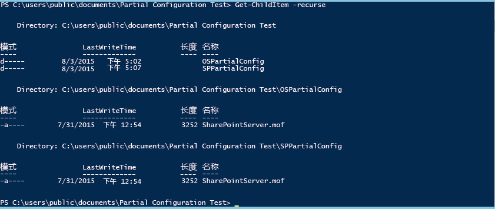
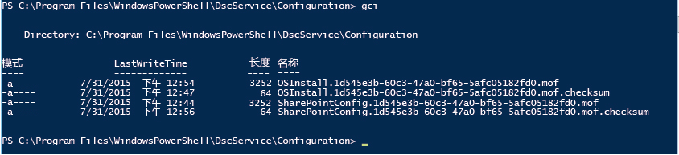

# PowerShell Desired State Configuration 部分配置

>适用于：Windows PowerShell 5.0

在 PowerShell 5.0 中，Desired State Configuration (DSC) 允许从多个源中以片段形式提交配置。 目标节点上的本地配置管理器 (LCM) 将碎片整理到一起，然后将其作为单个配置进行应用。 此功能允许在团队或个人之间共享配置控制权。 例如，如果两个或更多开发人员团队协作提供一项服务，那么每个团队都可以创建配置来管理该服务中由其负责的部分。 可以从不同请求服务器请求其中每个配置，并可以在各个开发阶段加入这些配置。 部分配置还允许不同的个人或团队控制配置节点的不同方面，而无需协调单个配置文档的编辑。 例如，可能由一个团队负责部署 VM 和操作系统，而由另一个团队负责在该 VM 上部署其它应用程序和服务。 使用部分配置，每个团队都可以创建自己的配置，避免任何不必要的复杂配置。

可以在推送模式、请求模式或两种模式的组合下使用部分配置。

## 推送模式下的部分配置
若要在推送模式下使用部分配置，你需要在目标节点上配置 LCM 以接收部分配置。 必须使用 Publish-DSCConfiguration cmdlet 将每个部分配置推送到目标。 然后，目标节点将部分配置组合成为单个配置。你可以通过调用 [Start-DscConfigurationxt](https://technet.microsoft.com/en-us/library/dn521623.aspx) cmdlet 来应用配置。

### 针对推送模式部分配置来配置 LCM
若要针对推送模式下的部分配置来配置 LCM，你可以为每个部分配置创建带有一个 **PartialConfiguration** 块的 **DSCLocalConfigurationManager** 配置。 有关配置 LCM 的详细信息，请参阅 [Windows 配置本地配置管理器](https://technet.microsoft.com/en-us/library/mt421188.aspx)。 下面的示例显示了需要两个部分配置的 LCM 配置：一个用于部署操作系统，另一个用于部署和配置 SharePoint。

```powershell
[DSCLocalConfigurationManager()]
configuration PartialConfigDemo
{
    Node localhost
    {
        
           PartialConfiguration OSInstall
        {
            Description = 'Configuration for the Base OS'
            RefreshMode = 'Push'
        }
           PartialConfiguration SharePointConfig
        {
            Description = 'Configuration for the SharePoint server'
            RefreshMode = 'Push'
        }
    }
}
PartialConfigDemo 
```

每个部分配置的 **RefreshMode** 都设置为“Push”。 **PartialConfiguration** 块的名称（在本例中即“OSInstall”和“SharePointConfig”）必须与推送到目标节点的配置名称完全匹配。

### 发布和启动推送模式部分配置


然后，可以对每个配置调用 **Publish-DSCConfiguration**，将包含配置文档的文件夹作为 Path 参数进行传递。 发布两个配置后，即可在目标节点上调用 `Start-DSCConfiguration –UseExisting`。

## 请求模式下的部分配置

可以从一个或多个请求服务器请求部分配置（有关请求服务器的详细信息，请参阅 [Windows PowerShell Desired State Configuration Pull Servers](pullServer.md)）。 若要执行此操作，必须在要请求部分配置的目标节点上配置 LCM，并在请求服务器上正确命名和定位配置文档。

### 针对请求节点配置来配置 LCM

若要配置 LCM 以从请求服务器请求部分配置，你需要在 **ConfigurationRepositoryWeb**（适用于 HTTP 请求服务器）或者 **ConfigurationRepositoryShare**（适用于 SMB 请求服务器）块上定义请求服务器。 然后创建 **PartialConfiguration** 块，这些块通过使用 **ConfigurationSource** 属性引用请求服务器。 你还需要创建用于指定 LCM 使用请求模式的 Settings 块，并指定请求服务器和目标节点用于识别配置的 ConfigurationID。 下面的元配置定义了名为 CONTOSO-PullSrv 的 HTTP 请求服务器，以及使用该请求服务器的两个部分配置。

```powershell
[DSCLocalConfigurationManager()]
configuration PartialConfigDemo
{
    Node localhost
    {
        Settings
        {
            RefreshMode = 'Pull'
            ConfigurationID = '1d545e3b-60c3-47a0-bf65-5afc05182fd0'
            RefreshFrequencyMins = 30 
            RebootNodeIfNeeded = $true
        }
        ConfigurationRepositoryWeb CONTOSO-PullSrv
        {
            ServerURL = 'https://CONTOSO-PullSrv:8080/PSDSCPullServer.svc'
            
        }
        
           PartialConfiguration OSInstall
        {
            Description = 'Configuration for the Base OS'
            ConfigurationSource = '[ConfigurationRepositoryWeb]CONTOSO-PullSrv'
            RefreshMode = 'Pull'
        }
           PartialConfiguration SharePointConfig
        {
            Description = 'Configuration for the Sharepoint Server'
            ConfigurationSource = '[ConfigurationRepositoryWeb]CONTOSO-PullSrv'
            DependsOn = [PartialConfiguration]OSInstall
            RefreshMode = 'Pull'
        }
    }
}
PartialConfigDemo 
```

你可以从多个请求服务器请求部分配置：定义每个请求服务器，然后在每个 PartialConfiguration 块中引用相应请求服务器即可。

创建元配置后，必须运行该元配置以创建配置文档（MOF 文件），然后调用 [Set-DscLocalConfigurationManager](https://technet.microsoft.com/en-us/library/dn521621(v=wps.630).aspx) 以配置 LCM。

### 在请求服务器上命名和放置配置文档

必须将部分配置文档置于请求服务器的 `web.config` 文件中指定为 **ConfigurationPath** 的文件夹中（通常为 `C:\Program Files\WindowsPowerShell\DscService\Configuration`）。 必须将配置文档命名如下：_ConfigurationName_. _ConfigurationID_`.mof`，其中 _ConfigurationName_ 是部分配置的名称，_ConfigurationID_ 是目标节点上 LCM 中定义的配置 ID。 在本例中，配置文档应命名如下。


### 从请求服务器上运行部分配置

在目标节点上配置 LCM，并在请求服务器上正确创建和命名配置文档后，目标节点将请求并合并部分配置，然后按照由 LCM 的 **RefreshFrequencyMins** 属性指定的固定时间间隔应用生成的配置。 如果你想强制进行刷新，可以调用 Update-DscConfiguration cmdlet 以请求配置，然后调用 `Start-DSCConfiguration –UseExisting` 以应用这些配置。

## 推送与请求混合模式下的部分配置

你还可以混用推送和请求模式以进行部分配置。 也就是说，你可以同时拥有一个从请求服务器请求的部分配置和另一个推送的部分配置。 根据上文各节中所述的配置刷新模式，使用需要的部分配置。 例如，下面的元配置描述了同一示例，它具有请求模式下的操作系统部分配置和推送模式下的 SharePoint 部分配置。

```powershell
[DSCLocalConfigurationManager()]
configuration PartialConfigDemo
{
    Node localhost
    {
        Settings
        {
            RefreshMode = 'Pull'
            ConfigurationID = '1d545e3b-60c3-47a0-bf65-5afc05182fd0'
            RefreshFrequencyMins = 30 
            RebootNodeIfNeeded = $true
        }
        ConfigurationRepositoryWeb CONTOSO-PullSrv
        {
            ServerURL = 'https://CONTOSO-PullSrv:8080/PSDSCPullServer.svc'
            
        }
        
           PartialConfiguration OSInstall
        {
            Description = 'Configuration for the Base OS'
            ConfigurationSource = '[ConfigurationRepositoryWeb]CONTOSO-PullSrv'
            RefreshMode = 'Pull'
        }
           PartialConfiguration SharePointConfig
        {
            Description = 'Configuration for the Sharepoint Server'
            DependsOn = [PartialConfiguration]OSInstall
            RefreshMode = 'Push'
        }
    }
}
PartialConfigDemo 
```

请注意，Settings 块中指定的 **RefreshMode** 为“Pull”，而 OSInstall 部分配置中的 **RefreshMode** 为“Push”。

可按照上文所述的相应刷新模式命名和放置配置文档。 可调用 **Publish-DSCConfiguration** 来发布 SharePointInstall 部分配置，并等待从请求服务器请求 OSInstall 配置或通过调用 [Update-DscConfiguration](https://technet.microsoft.com/en-us/library/mt143541(v=wps.630).aspx) 强制进行刷新。

##另请参阅 

**概念**
[Windows PowerShell Desired State Configuration 请求服务器](pullServer.md)
[Windows 配置本地配置管理器](https://technet.microsoft.com/en-us/library/mt421188.aspx) 
<!--HONumber=Feb16_HO4-->
