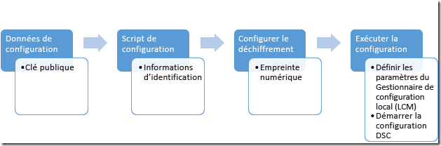

# 保护 MOF 文件

>适用于：Windows PowerShell 4.0 和 Windows PowerShell 5.0

DSC 通过将包含配置信息的 MOF 文件发送到各个节点，告知目标节点应有的配置，本地配置管理器 (LCM) 在这些节点上实施所需配置。 由于此文件包含配置的详细信息，因此确保其安全非常重要。 为此，你可以将 LCM 设置为检查用户凭据。 本主题介绍如何通过证书加密将这些凭据安全传输到目标节点。

>**注意：**本主题讨论用于加密的证书。 对于加密，自签名证书就已足够，因为私钥始终保密，而加密并不表示信任该文档。 自签名证书*不*得用于身份验证目的。 应使用来自受信任的证书颁发机构 (CA) 的证书进行任何身份验证。

## 必备条件

要成功加密所用凭据以保护 DSC 配置，请确保你有以下各项：

* **颁发和分发证书的方法**。 本主题及其中示例假定你使用 Active Directory 证书颁发机构。 有关 Active Directory 证书服务的更多背景信息，请参阅 [Active Directory 证书服务概述](https://technet.microsoft.com/library/hh831740.aspx)和 [Windows Server 2008 中的 Active Directory 证书服务](https://technet.microsoft.com/windowsserver/dd448615.aspx)。
* **对目标节点的管理访问权限**。
* **每个目标节点的个人存储区中均保存了可加密的证书**。 在 Windows PowerShell 中，该存储区的路径为 Cert:\LocalMachine\My。 本主题中的示例使用“工作站身份验证”模板，你可以在[默认证书模板](https://technet.microsoft.com/library/cc740061(v=WS.10).aspx)中找到它（以及其他证书模板）。
* 如果你将在计算机而不是目标节点上运行此配置，请**导出证书的公钥**，然后将其导入到你将要从中运行配置的计算机。 请确保仅导出**公**钥；保护私钥安全。

## 整体过程

 1. 设置证书、密钥和指纹，确保每个目标节点具有证书的副本，且配置计算机具有公钥和指纹。
 2. 创建包含公钥的路径和指纹的配置数据块。
 3. 创建配置脚本，该脚本定义目标节点的所需配置，并通过命令本地配置管理器使用证书及其指纹解密配置数据来设置目标节点上的解密。
 4. 运行配置，这将设置本地配置管理器设置并启动 DSC 配置。



## 证书要求

若要执行凭据加密，公钥证书必须在受用于创作 DSC 配置的计算机**信任**的_目标节点_上可用。
若要将此公钥证书用于 DSC 凭据加密，它需具有以下特定要求：
 1. **密钥用法**：
   - 必须包含：“KeyEncipherment”和“DataEncipherment”。
   - _不_应包含：“数字签名”。
 2. **增强型密钥用法**：
   - 必须包含：文档加密 (1.3.6.1.4.1.311.80.1)。
   - _不_应包含：客户端身份验证 (1.3.6.1.5.5.7.3.2) 和服务器身份验证 (1.3.6.1.5.5.7.3.1)。
 3. 证书的私钥在*目标节点_上可用。
 4. 证书的**提供程序**必须是“Microsoft RSA SChannel Cryptographic Provider”。
 
>**推荐最佳做法：**虽然你可以使用包含“数字签名”密钥用法或某个身份验证 EKU 的证书，但这会导致加密密钥更容易被误用，而且更容易受到攻击。 因此，最好是使用为保护 DSC 凭据而专门创建的省略了这些密钥用法和 EKU 的证书。
  
_目标节点_上满足这些条件的任何现有证书都可以用于保护 DSC 凭据。

## 证书创建

可以采用两种方法创建和使用所需的加密证书（公钥-私钥对）。

1. 在**目标节点**上创建密钥对，并仅将公钥导出到**创作节点**
2. 在**创作节点**上创建密钥对，并将整个密钥对导出到**目标节点**

建议使用方法 1，因为用于解密 MOF 中凭据的私钥始终停留在目标节点上。


### 在目标节点上创建证书

私钥必须是保密的，因为它可用于解密**目标节点**上的 MOF。为此，最简单的方法是在**目标节点**上创建私钥证书，并将**公钥证书**复制到用于将 DSC 配置编写到 MOF 文件中的计算机内。
以下示例：
 1. 在**目标节点**上创建证书
 2. 在**目标节点**上导出公钥证书。
 3. 将公钥证书导入到**创作节点**上**我的**证书存储。

#### 在目标节点上：创建并导出证书
>创作节点：Windows Server 2016 和 Windows 10

```powershell
# note: These steps need to be performed in an Administrator PowerShell session
$cert = New-SelfSignedCertificate -Type DocumentEncryptionCertLegacyCsp -DnsName 'DscEncryptionCert' -HashAlgorithm SHA256
# export the public key certificate
$cert | Export-Certificate -FilePath "$env:temp\DscPublicKey.cer" -Force
```
一旦导出完成，需要将 ```DscPublicKey.cer``` 复制到**创作节点**。

>创作节点：Windows Server 2012 R2/Windows 8.1 及更早版本

因为 Windows 10 和 Windows Server 2016 之前版本的 Windows 操作系统上的 New-SelfSignedCertificate cmdlet 不支持 **Type** 参数，因此在这些操作系统上创建此证书需要其他方法。
在这种情况下，可以使用 ```makecert.exe``` 或者 ```certutil.exe``` 来创建证书。

一种替代方法是[从 Microsoft 脚本中心下载 New-SelfSignedCertificateEx.ps1 脚本](https://gallery.technet.microsoft.com/scriptcenter/Self-signed-certificate-5920a7c6) 并改为使用它来创建证书：
```powershell
# note: These steps need to be performed in an Administrator PowerShell session
# and in the folder that contains New-SelfSignedCertificateEx.ps1
. .\New-SelfSignedCertificateEx.ps1
New-SelfsignedCertificateEx `
    -Subject "CN=${ENV:ComputerName}" `
    -EKU 'Document Encryption' `
    -KeyUsage 'KeyEncipherment, DataEncipherment' `
    -SAN ${ENV:ComputerName} `
    -FriendlyName 'DSC Credential Encryption certificate' `
    -Exportable `
    -StoreLocation 'LocalMachine' `
    -StoreName 'My' `
    -KeyLength 2048 `
    -ProviderName 'Microsoft Enhanced Cryptographic Provider v1.0' `
    -AlgorithmName 'RSA' `
    -SignatureAlgorithm 'SHA256'
# Locate the newly created certificate
$Cert = Get-ChildItem -Path cert:\LocalMachine\My `
    | Where-Object {
        ($_.FriendlyName -eq 'DSC Credential Encryption certificate') `
        -and ($_.Subject -eq "CN=${ENV:ComputerName}")
    } | Select-Object -First 1
# export the public key certificate
$cert | Export-Certificate -FilePath "$env:temp\DscPublicKey.cer" -Force
```
一旦导出完成，需要将 ```DscPublicKey.cer``` 复制到**创作节点**。

#### 在创作节点上：导入证书的公钥
```powershell
# Import to the my store
Import-Certificate -FilePath "$env:temp\DscPublicKey.cer" -CertStoreLocation Cert:\LocalMachine\My
```

### 在创作节点上创建证书
或者，可以在**创作节点**上创建加密证书，并与**私钥**以 PFX 文件导出，然后在**目标节点**上导入。
这是当前用于在 _Nano Server_ 上实现 DSC 凭据加密的方法。
尽管 PFX 使用密码保护，但在传输过程中也应保证其安全性。
以下示例：
 1. 在**创作节点**上创建证书
 2. 在**创作节点**上导出证书（包括私钥）。
 3. 从**创作节点**中删除私钥，但将公钥证书保留在**我的**存储。
 4. 将私钥证书导入到**目标节点**上的根证书存取。
   - 必须将其添加到根存储，以便受到**目标节点**的信任。

#### 在创作节点上：创建并导出证书
>目标节点：Windows Server 2016 和 Windows 10

```powershell
# note: These steps need to be performed in an Administrator PowerShell session
$cert = New-SelfSignedCertificate -Type DocumentEncryptionCertLegacyCsp -DnsName 'DscEncryptionCert' -HashAlgorithm SHA256
# export the private key certificate
$mypwd = ConvertTo-SecureString -String "YOUR_PFX_PASSWD" -Force -AsPlainText
$cert | Export-PfxCertificate -FilePath "$env:temp\DscPrivateKey.pfx" -Password $mypwd -Force
# remove the private key certificate from the node but keep the public key certificate
$cert | Export-Certificate -FilePath "$env:temp\DscPublicKey.cer" -Force
$cert | Remove-Item -Force
Import-Certificate -FilePath "$env:temp\DscPublicKey.cer" -CertStoreLocation Cert:\LocalMachine\My
```
一旦导出完成，需要将 ```DscPrivateKey.cer``` 复制到**目标节点**。

>目标节点：Windows Server 2012 R2/Windows 8.1 及更早版本

因为 Windows 10 和 Windows Server 2016 之前版本的 Windows 操作系统上的 New-SelfSignedCertificate cmdlet 不支持 **Type** 参数，因此在这些操作系统上创建此证书需要其他方法。
在这种情况下，可以使用 ```makecert.exe``` 或者 ```certutil.exe``` 来创建证书。

一种替代方法是[从 Microsoft 脚本中心下载 New-SelfSignedCertificateEx.ps1 脚本](https://gallery.technet.microsoft.com/scriptcenter/Self-signed-certificate-5920a7c6) 并改为使用它来创建证书：
```powershell
# note: These steps need to be performed in an Administrator PowerShell session
# and in the folder that contains New-SelfSignedCertificateEx.ps1
. .\New-SelfSignedCertificateEx.ps1
New-SelfsignedCertificateEx `
    -Subject "CN=${ENV:ComputerName}" `
    -EKU 'Document Encryption' `
    -KeyUsage 'KeyEncipherment, DataEncipherment' `
    -SAN ${ENV:ComputerName} `
    -FriendlyName 'DSC Credential Encryption certificate' `
    -Exportable `
    -StoreLocation 'LocalMachine' `
    -StoreName 'My' `
    -KeyLength 2048 `
    -ProviderName 'Microsoft Enhanced Cryptographic Provider v1.0' `
    -AlgorithmName 'RSA' `
    -SignatureAlgorithm 'SHA256'
# Locate the newly created certificate
$Cert = Get-ChildItem -Path cert:\LocalMachine\My `
    | Where-Object {
        ($_.FriendlyName -eq 'DSC Credential Encryption certificate') `
        -and ($_.Subject -eq "CN=${ENV:ComputerName}")
    } | Select-Object -First 1
# export the public key certificate
$mypwd = ConvertTo-SecureString -String "YOUR_PFX_PASSWD" -Force -AsPlainText
$cert | Export-PfxCertificate -FilePath "$env:temp\DscPrivateKey.pfx" -Password $mypwd -Force
# remove the private key certificate from the node but keep the public key certificate
$cert | Export-Certificate -FilePath "$env:temp\DscPublicKey.cer" -Force
$cert | Remove-Item -Force
Import-Certificate -FilePath "$env:temp\DscPublicKey.cer" -CertStoreLocation Cert:\LocalMachine\My
```

#### 在目标节点上：将证书的私钥导入为受信任的根
```powershell
# Import to the root store so that it is trusted
$mypwd = ConvertTo-SecureString -String "YOUR_PFX_PASSWD" -Force -AsPlainText
Import-PfxCertificate -FilePath "$env:temp\DscPrivateKey.pfx" -CertStoreLocation Cert:\LocalMachine\Root -Password $mypwd > $null
```

## 配置数据

配置数据块定义在哪个目标节点上进行操作、是否加密凭据、加密方式以及其他信息。 有关配置数据块的详细信息，请参阅[分隔配置和环境数据](configData.md)。

可以为与凭据加密相关的每个节点配置的元素有：
* **NodeName** - 为其配置凭据加密的目标节点的名称。
* **PsDscAllowPlainTextPassword** - 是否允许将未加密的凭据传递给此节点。 **不建议**使用此元素。
* **Thumbprint** -将用于在_目标节点_上的 DSC 配置中解密凭据的证书的指纹。 **此证书必须存在于目标节点上的本地计算机证书存储中。**
* **CertificateFile** - 应该用于为_目标节点_加密凭据的证书文件（只包含公钥）。 它必须是 DER 编码的二进制 X.509 或 Base-64 编码的 X.509 格式证书文件。

此示例显示了一个配置数据块，该数据块指定了要操作的名为 targetNode 的目标节点、公钥证书文件（名为 targetNode.cer）的路径和公钥的指纹。

```powershell
$ConfigData= @{ 
    AllNodes = @(     
            @{  
                # The name of the node we are describing 
                NodeName = "targetNode" 

                # The path to the .cer file containing the 
                # public key of the Encryption Certificate 
                # used to encrypt credentials for this node 
                CertificateFile = "C:\publicKeys\targetNode.cer" 

         
                # The thumbprint of the Encryption Certificate 
                # used to decrypt the credentials on target node 
                Thumbprint = "AC23EA3A9E291A75757A556D0B71CBBF8C4F6FD8" 
            }; 
        );    
    }
```


## 配置脚本

在配置脚本中，使用 `PsCredential` 参数确保凭据存储时间尽可能短。 运行提供的示例时，DSC 将提示你输入凭据，然后使用配置数据块中与目标节点相关联的 CertificateFile 加密 MOF 文件。 此代码示例将文件从受保护共享复制到用户。

```
configuration CredentialEncryptionExample 
{ 
    param( 
        [Parameter(Mandatory=$true)] 
        [ValidateNotNullorEmpty()] 
        [PsCredential] $credential 
        ) 
    

    Node $AllNodes.NodeName 
    { 
        File exampleFile 
        { 
            SourcePath = "\\Server\share\path\file.ext" 
            DestinationPath = "C:\destinationPath" 
            Credential = $credential 
        } 
    } 
}
```

## 设置加密

必须使用 CertificateID 资源验证证书的指纹，从而告知每个目标节点上的本地配置管理器用于解密凭据的证书，[`Start-DscConfiguration`](https://technet.microsoft.com/en-us/library/dn521623.aspx) 方可生效。 此示例函数将查找适当的本地证书（你可能需要对它进行自定义，以便它准确地找到你想使用的证书）：

```powershell
# Get the certificate that works for encryption 
function Get-LocalEncryptionCertificateThumbprint 
{ 
    (dir Cert:\LocalMachine\my) | %{
        # Verify the certificate is for Encryption and valid 
        if ($_.PrivateKey.KeyExchangeAlgorithm -and $_.Verify()) 
        { 
            return $_.Thumbprint 
        } 
    } 
}
```

使用证书指纹标识证书后，即可更新配置脚本以使用该值：

```powershell
configuration CredentialEncryptionExample 
{ 
    param( 
        [Parameter(Mandatory=$true)] 
        [ValidateNotNullorEmpty()] 
        [PsCredential] $credential 
        ) 
    

    Node $AllNodes.NodeName 
    { 
        File exampleFile 
        { 
            SourcePath = "\\Server\share\path\file.ext" 
            DestinationPath = "C:\destinationPath" 
            Credential = $credential 
        } 
        
        LocalConfigurationManager 
        { 
             CertificateId = $node.Thumbprint 
        } 
    } 
}
```

## 运行配置

此时，你可以运行配置，此操作将输出两个文件：

 * *.meta.mof 文件，它将本地配置管理器配置为使用存储在本地计算机存储区上且由其指纹进行标识的证书来解密凭据。[`Set-DscLocalConfigurationManager`](https://technet.microsoft.com/en-us/library/dn521621.aspx) 应用 *.meta.mof 文件。
 * 实际应用配置的 MOF 文件。 Start-DscConfiguration 应用配置。

这些命令将完成这些步骤：

```powershell
Write-Host "Generate DSC Configuration..."
CredentialEncryptionExample -ConfigurationData $ConfigData -OutputPath .\CredentialEncryptionExample

Write-Host "Setting up LCM to decrypt credentials..."
Set-DscLocalConfigurationManager .\CredentialEncryptionExample -Verbose 
 
Write-Host "Starting Configuration..."
Start-DscConfiguration .\CredentialEncryptionExample -wait -Verbose
```

此示例将 DSC 配置推送到目标节点。
还可以使用 DSC 请求服务器（如果可用）来应用 DSC 配置。

有关使用 DSC 请求服务器应用 DSC 配置的详细信息，请参阅[设置 DSC 请求客户端](pullClient.md)。

## 凭据加密模块示例

以下是包含所有步骤的完整示例，以及用于导出和复制公钥的帮助程序 cmdlet：

```powershell
# A simple example of using credentials
configuration CredentialEncryptionExample
{
    param(
        [Parameter(Mandatory=$true)]
        [ValidateNotNullorEmpty()]
        [PsCredential] $credential
        )
    

    Node $AllNodes.NodeName
    {
        File exampleFile
        {
            SourcePath = "\\server\share\file.txt"
            DestinationPath = "C:\Users\user"
            Credential = $credential
        }
        
        LocalConfigurationManager
        {
            CertificateId = $node.Thumbprint
        }
    }
}

# A Helper to invoke the configuration, with the correct public key 
# To encrypt the configuration credentials
function Start-CredentialEncryptionExample
{
    [CmdletBinding()]
    param ($computerName)


    [string] $thumbprint = Get-EncryptionCertificate -computerName $computerName -Verbose
    Write-Verbose "using cert: $thumbprint"

    $certificatePath = join-path -Path "$env:SystemDrive\$script:publicKeyFolder" -childPath "$computername.EncryptionCertificate.cer"         

    $ConfigData=    @{
        AllNodes = @(     
                        @{  
                            # The name of the node we are describing
                            NodeName = "$computerName"

                            # The path to the .cer file containing the
                            # public key of the Encryption Certificate
                            CertificateFile = "$certificatePath"

                            # The thumbprint of the Encryption Certificate
                            # used to decrypt the credentials
                            Thumbprint = $thumbprint
                        };
                    );    
    }

    Write-Verbose "Generate DSC Configuration..."
    CredentialEncryptionExample -ConfigurationData $ConfigData -OutputPath .\CredentialEncryptionExample `
        -credential (Get-Credential -UserName "$env:USERDOMAIN\$env:USERNAME" -Message "Enter credentials for configuration") 

    Write-Verbose "Setting up LCM to decrypt credentials..."
    Set-DscLocalConfigurationManager .\CredentialEncryptionExample -Verbose 

    Write-Verbose "Starting Configuration..."
    Start-DscConfiguration .\CredentialEncryptionExample -wait -Verbose

}


#region HelperFunctions

# The folder name for the exported public keys
$script:publicKeyFolder = "publicKeys"

# Get the certificate that works for encryptions
function Get-EncryptionCertificate
{
    [CmdletBinding()]
    param ($computerName)
    $returnValue= Invoke-Command -ComputerName $computerName -ScriptBlock {
            $certificates = dir Cert:\LocalMachine\my

            $certificates | %{
                    # Verify the certificate is for Encryption and valid
                    if ($_.PrivateKey.KeyExchangeAlgorithm -and $_.Verify())
                    {
                        # Create the folder to hold the exported public key
                        $folder= Join-Path -Path $env:SystemDrive\ -ChildPath $using:publicKeyFolder
                        if (! (Test-Path $folder))
                        {
                            md $folder | Out-Null
                        }

                        # Export the public key to a well known location
                        $certPath = Export-Certificate -Cert $_ -FilePath (Join-Path -path $folder -childPath "EncryptionCertificate.cer") 

                        # Return the thumbprint, and exported certificate path
                        return @($_.Thumbprint,$certPath);
                    }
                  }
        }
    Write-Verbose "Identified and exported cert..."
    # Copy the exported certificate locally
    $destinationPath = join-path -Path "$env:SystemDrive\$script:publicKeyFolder" -childPath "$computername.EncryptionCertificate.cer"
    Copy-Item -Path (join-path -path \\$computername -childPath $returnValue[1].FullName.Replace(":","$"))  $destinationPath | Out-Null

    # Return the thumbprint
    return $returnValue[0]
}

Start-CredentialEncryptionExample
```


<!--HONumber=Jun16_HO4-->


