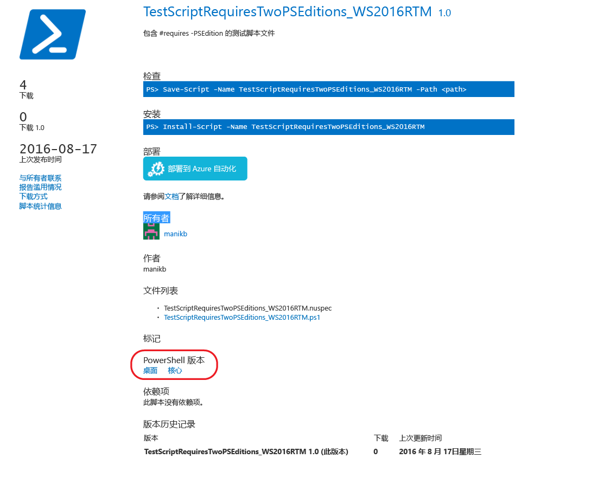

# 具有兼容 PowerShell 版本的项

从版本 5.1 开始，PowerShell 以表现出不同功能集和平台兼容性的不同版本提供。

- **桌面版：** 以 .NET Framework 为基础构建，提供与面向在完整功能 Windows 版本（如服务器核心和 Windows 桌面）上运行的 PowerShell 版本的脚本和模块的兼容性。
- **核心版：** 以 .NET Core 为基础构建，提供与面向在缩减功能 Windows 版本（如 Nano Server 和 Windows IoT）上运行的 PowerShell 版本的脚本和模块的兼容性。

## PowerShell 库提取支持的 PSEditions 元数据，并允许筛选兼容特定 PowerShell 版本的项

如果某个项已指定兼容的 PSEditions，则会在项显示页和项结果中将其显示为“PowerShell Editions”的一部分。

## 搜索在 PowerShellCore 上工作的库 UI 中的项

使用标记“PSEdition_Desktop”和标记“PSEdition_Core”筛选 PowerShell 库中的项。

### 使用标记“PSEdition_Core”搜索兼容 PowerShell 核心版本的项。

### 使用标记“PSEdition_Desktop”搜索兼容 PowerShell Desktop Edition 的项。

## 有关创作和查找兼容 PowerShell 版本的项的详细信息

- [PSEditions 模块](../../concepts/module-psedition-support.md)
- [PSEditions 脚本](../../concepts/script-psedition-support.md)