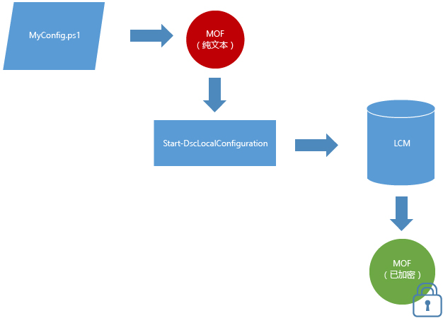

# MOF 文档默认加密

配置文档包含敏感信息。 在以前版本的 DSC 中，你需要分发和管理证书以确保配置中的凭据安全。 对于许多人来说，这是一项重大的管理负担，即使为此大费周章，仍会余下某些尚未（且无法）确保安全配置信息。 

现在已经不再如此，因为**默认保护所有配置 MOF**。 不需要任何证书或元配置设置。 目标节点上的本地配置管理器 (LCM) 每次将配置 MOF 保存到磁盘时都将对其进行加密。 使用 [DPAPI](https://msdn.microsoft.com/en-us/library/ms995355.aspx) 加密 MOF。 **注意：**配置脚本生成的 MOF 未加密。

**示例：**推送模式加密 

如果你已将证书方法用于加密密码，或者你的密码需要额外的安全性，[基于证书加密的现有方法](https://msdn.microsoft.com/en-us/powershell/dsc/securemof)将继续发挥作用。 将得到使用 DPAPI 完全加密的 MOF 文档，并在其中对密码额外进行了加密。

这种加密仅适用于配置 MOF 文档（例如 pending.mof、current.mof、previous.mof 和部分 MOF）。 仍以纯文本格式保存元配置 MOF，因为它们不太可能包含机密信息。

<!--HONumber=Jul16_HO1-->

