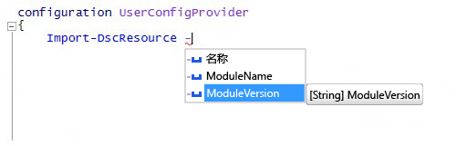

# Import-DscResource 关键字支持 -ModuleVersion 参数

我们向创作 DSC 配置时可用的 `Import-DscResource` 动态关键字添加了一个新参数。 现在，配置作者可以明确指定从中加载 DSC 资源的模块版本。 该关键字的新语法为：

```powershell
Import-DscResource [-Name <ResourceName(s)>] [-ModuleName <ModuleName(s)>] [-ModuleVersion <ModuleVersion>]
```

* **Name**：要导入的一个或多个资源的名称。
* **ModuleName**：要导入的一个或多个模块的模块名称或 ModuleSpecification 对象。
* **ModuleVersion**：要导入的模块的版本。 如果使用 ModuleName，则它只能表示一个模块的名称。 

在 Windows PowerShell ISE 中，它与 IntelliSense 一起出现：



**注意**：`–ModuleVersion` 参数只能与 `–ModuleName` 参数结合使用。 它不能与仅使用 `–Name` 参数的资源名称一起使用。

在此之前，加载 DSC 资源时指定模块版本的唯一方法是通过使用模块规范对象，例如：`–ModuleName @{ModuleName="UserConfigProvider";ModuleVersion="3.0"}`

<!--HONumber=Mar16_HO2-->
