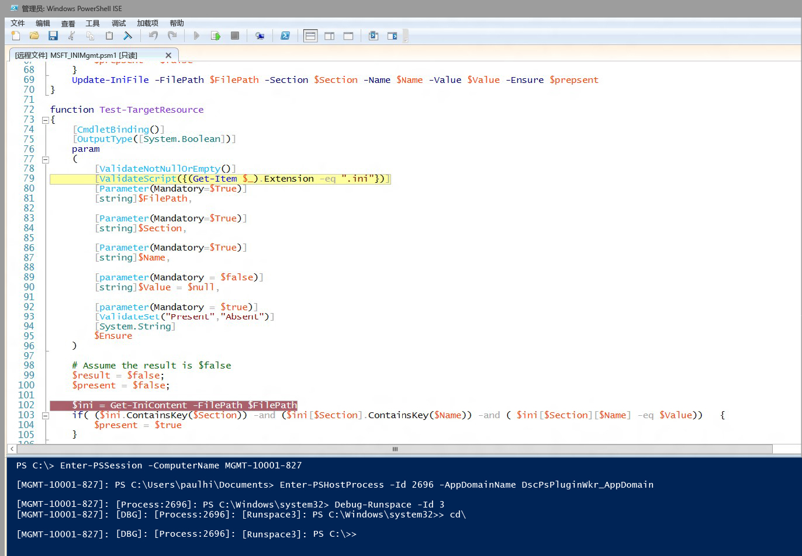

# DSC 资源脚本调试
WMF 5.0 生产预览版支持当 DSC 资源脚本在目标节点上运行时对其进行调试。 在早期 WMF 5.0 版本中，我们在高级脚本调试功能中添加了附加到本地进程（Get-PSHostProcessInfo、Enter-PSHostProcessInfo、Exit-PSHostProcessInfo）、枚举进程中所有运行空间和调试进程中任意运行空间（Get-Runspace、Debug-Runspace）的功能。

通过添加两个新的 cmdlet，在这一工作的基础上实现 DSC 资源脚本调试。

##语法
**Enable-DscDebug**
Enable-DscDebug \[-BreakAll\] \[-CimSession &lt;CimSession\[\]&gt;\] \[-ThrottleLimit &lt;int&gt;\] \[-AsJob\] \[-WhatIf\] \[-Confirm\] \[&lt;CommonParameters&gt;\]

**Disable-DscDebug**
Disable-DscDebug \[-CimSession &lt;CimSession\[\]&gt;\] \[-ThrottleLimit &lt;int&gt;\] \[-AsJob\] \[-WhatIf\] \[-Confirm\] \[&lt;CommonParameters&gt;\]

##典型工作流


```PowerShell
PS C:\Test> Enable-DscDebug –BreakAll

PS C:\Test> Start-DscConfiguration -path .\TestConfig2 -Wait -Verbose
VERBOSE: Perform operation 'Invoke CimMethod' with following parameters, ''namespaceName' = root/Microsoft/Windows/DesiredStateConfiguration,'className' = MSFT\_DSCLocalConfigurationManager,'methodName' = SendConfigurationApply'.
VERBOSE: An LCM method call arrived from computer MGMT-10001-827 with user sid S-1-5-21-397955417-626881126-188441444-3860663.
VERBOSE: [MGMT-10001-827]: LCM: [ Start Set ]
WARNING: [MGMT-10001-827]: [DSCEngine] Warning LCM is in Debug 'ResourceScriptBreakAll' mode. Resource script processing will be stopped to wait for PowerShell script debugger to attach.
VERBOSE: [MGMT-10001-827]: [DSCEngine] Importing the module C:\WINDOWS\system32\WindowsPowerShell\v1.0\Modules\PSDesiredStateConfiguration\DscResources\MSFT_EnvironmentResource\MSFT_EnvironmentResource.psm1 in force mode.
VERBOSE: [MGMT-10001-827]: LCM: [ Start Resource ] [[Environment]e1]
VERBOSE: [MGMT-10001-827]: LCM: [ Start Test ] [[Environment]e1]
VERBOSE: [MGMT-10001-827]: [[Environment]e1] Importing the module MSFT_EnvironmentResource in force mode.
WARNING: [MGMT-10001-827]: [[Environment]e1] Resource is waiting for PowerShell script debugger to attach. Use the following commands to begin debugging this resource script:
Enter-PSSession -ComputerName MGMT-10001-827 -Credential <credentials>
Enter-PSHostProcess -Id 2640 -AppDomainName DscPsPluginWkr_AppDomain
Debug-Runspace -Id 3

PS C:\Test> Disable-DscDebug
```
现在让我们看一看每个命令及其作用：

**Enable-DscDebug –BreakAll**
带有 BreakAll 的 Enable-DscDebug cmdlet 可将 DSC LCM 配置为以“全部中断”模式运行 Get-TargetResource、Set-TargetResource 和 Test-TargetResource 脚本。 这意味着脚本将在第一个脚本语句处停止，并等待附加调试器。 你可以随后使用 Windows PowerShell 远程处理连接到目标计算机，并将 Windows PowerShell 调试器附加到 LCM 进程和运行空间以调试脚本。 执行此操作之后，可以设置断点并以常规 Windows PowerShell 方式调试脚本。

**Start-DscConfiguration -path .\TestConfig2 -Wait -Verbose**

这将启动 DSC，但如上所述，由于目标节点启用了调试模式，它将在 LCM 执行的第一个 DSC 资源处停止。

为了开始调试在运行 Start-DscConfiguration 后运行警告消息中所示命令的会话，请将客户端 Windows PowerShell 脚本调试器附加到相应的计算机、进程、应用程序域和运行空间。

* 运行此命令以选择使用 Windows PowerShell 远程处理连接到目标计算机。 如果已经建立远程桌面连接，请跳过此操作。
```PowerShell
Enter-PSSession -ComputerName MGMT-10001-827
```
* 此命令可附加到资源脚本运行于的 DSC LCM 主机进程和应用程序域。
```PowerShell
Enter-PSHostProcess -Id 2640 -AppDomainName DscPsPluginWkr\_AppDomain
```
*  上个命令可用于调试运行脚本的 DSC 运行空间。
```PowerShell
Debug-Runspace -Id 3
```


附加调试程序后，在要调查脚本执行处设置行断点并运行 **continue** 调试器命令，以使脚本在调试器中运行。 完成调试后，可通过键入 **quit** 调试器命令使脚本终止运行，或运行 **detach** 调试器命令使脚本在不使用调试器的情况下继续运行。

请注意，***所有***资源脚本都将在调试器中终止。 这意味着 Test-TargetResoruce、Set-TargetResource 和 Get-TargetResource 脚本都将在调试器中终止。 如果你不想调试资源脚本，可以通过运行此命令在运行空间中退出调试模式。

Disable-RunspaceDebug -RunspaceId 3

也可以通过运行 Debug-Runspace 来附加调试器，然后立即运行 **detach** 命令。

调试完资源脚本后，应通过运行以下命令来停止 DSC 配置。

Stop-DscConfiguration –Force

最后，你必须使用 Disable-DscDebug cmdlet 将目标计算机 LCM 重新配置为禁用调试模式。<!--HONumber=Mar16_HO2-->
